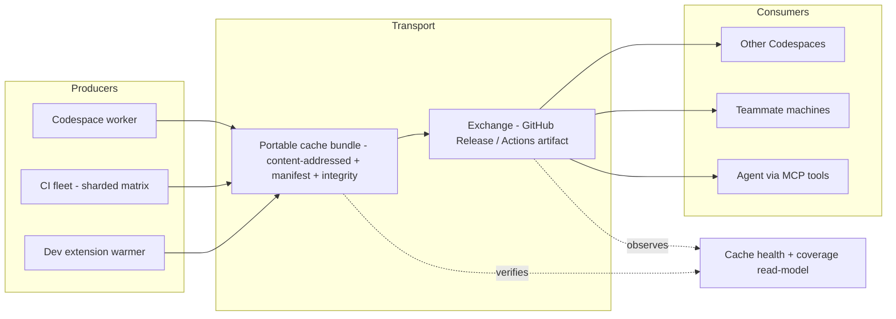

# Preview-Cache Fabric

> Status: incremental. Phase 1 (producer) ships the headless worker
> (VHS-REQ-671); later phases are tracked requirements, not yet all implemented.

## Why

Rendering a single LabVIEW VI to an interactive HTML preview (VHS-REQ-659) is
expensive: a cold LabVIEW launch is roughly 30–140 seconds. The extension
already caches each rendered document so reopening an unchanged VI is instant,
and a background warmer pre-renders a workspace's VIs. But that cache is
**local to one machine** and is filled only through the VS Code UI.

Two properties of the cache make it far more valuable than a per-machine
scratch folder:

- **Content-addressed.** Each entry's key is a SHA-256 over the target VI plus
  its staged dependency file set (path + size + mtime). The stored document is
  `<key>.html`.
- **Reproducible and machine-independent.** The same VI content renders to the
  same document regardless of where it was produced.

Together these mean a cache entry generated **anywhere** is valid **everywhere**
for the same VI content. So the expensive render should happen **once** and then
be inspected, moved, verified, and shared — a *fabric* rather than a folder.

## The fabric



Because entries are content-addressed, bundles **merge and dedupe** losslessly,
staleness is **detectable** (an entry's content signature versus the current
tree), and integrity is **verifiable** (a digest per entry).

## Requirement arc

Each capability reuses a pattern already proven elsewhere in the repository.

| Requirement | Capability | Reuses |
| --- | --- | --- |
| VHS-REQ-671 | Headless preview-cache **worker** (batch warm CLI) | `warmViPreviewCache`, `createFileViPreviewCache`, `renderViPreviewForFile` (VHS-REQ-659) |
| VHS-REQ-672 | Portable cache **bundle** (content-addressed archive, key→VI-path manifest, per-entry integrity; export/import) | schema-envelope read-models; content-addressed IDs |
| VHS-REQ-673 | Cache **exchange** (publish/fetch/verify/merge) | dev-tools release channel (VHS-REQ-667) |
| VHS-REQ-674 | Cache-generation **fleet** (sharded Actions matrix + merge/publish) | reusable callable workflow (VHS-REQ-661) |
| VHS-REQ-675 | Cache **health/coverage** read-model (cached / stale / missing vs current content) | preview diagnostics (`preview-diagnostics@v1`) + MCP cache inspection |

The agent-facing MCP tools (inspect / pull / seed) are the fabric's agent
interface: read-only inspection ships today (`list_preview_cache`,
`summarize_preview_cache`, `diagnose_preview_cache`, `search_preview_cache`,
`get_preview_cache_entry`); pull and seed are planned.

## Phase 1 — the worker (VHS-REQ-671)

`npm run preview:cache:warm` turns any Docker-capable environment — a GitHub
Codespace, a CI runner, or a developer box — into a worker that generates and
stores preview caches for a whole workspace without the VS Code UI:

1. Resolve the Docker preview runtime once.
2. Enumerate the workspace's VIs (`listWorkspaceViFiles`, the headless
   equivalent of the extension warmer's `vscode.workspace.findFiles` scan).
3. Warm each VI serially through the shared warm loop into a file-backed cache
   at `--cache-dir`.
4. Emit a self-describing `vi-history-suite/preview-cache-warm@v1` packet whose
   per-entry **manifest** maps each content-addressed cache key to its VI
   (outcome, bytes, inline-image count).

That manifest is the seed for every later phase: it is what a bundle carries,
what the exchange verifies, and what the coverage read-model reports against.

### Using a Codespace as a worker

```bash
# From an authenticated host, against a running Codespace:
gh codespace ssh -c <codespace> -- \
  'cd /workspaces/<repo> && npm run preview:cache:warm -- \
     --cache-dir .vihs-preview-cache --json'
```

The worker requires an explicit `--cache-dir` (a scratch directory is
recommended); the extension's own cache lives under the host's
`globalStorage/<publisher>.vi-history-suite/vi-preview-cache`.

To open a Codespace on **any** LabVIEW repository as a worker, copy
[`docs/consumer-workflows/codespace-preview-cache.devcontainer.json`](../consumer-workflows/codespace-preview-cache.devcontainer.json)
into that repository's `.devcontainer/devcontainer.json`: it enables
Docker-in-Docker, installs the extension, and turns on the preview feature so
the Codespace is ready to generate and store caches.

## Phase 2 (observability) — the health read-model (VHS-REQ-675)

`npm run preview:cache:health` reports how well a cache directory covers a
workspace by comparing three ground-truth inputs — the current workspace VI
enumeration, a prior warm manifest (`preview-cache-warm@v1`), and the cache
directory's present `<key>.html` files — and classifies each VI as **cached**,
**stale** (warmed to a key whose file is now gone), or **missing**. It also
reports orphaned cache files, removed VIs, and an overall coverage percentage in
a `vi-history-suite/preview-cache-health@v1` packet. `--strict` fails closed
when the cache does not fully cover the workspace, so CI can gate on coverage.
Read-only; never renders.

## Phase 2 (portability) — the bundle (VHS-REQ-672)

`npm run preview:cache:bundle` packages a cache directory into a portable,
content-addressed **bundle** (a `manifest.json` — `vi-history-suite/preview-cache-bundle@v1`,
with a per-entry integrity digest and the VI path(s) each document renders — plus
the `<key>.html` documents). `unbundle` verifies a bundle against those digests
and **losslessly merges** it into a target cache: content-addressing means a key
already present is skipped, a tampered or missing document is rejected, and the
rest are added, order-independently. This is what makes a cache generated once
shareable.

## Phase 3 (distribution) — the exchange (VHS-REQ-673)

`npm run preview:cache:exchange` distributes bundles between environments over
GitHub Releases, reusing the dev-tools release-channel transport (VHS-REQ-667):
`publish` packs a bundle and creates a **content-addressed** release (tag
`preview-cache-<digest>`, identical content published twice is skipped); `fetch`
downloads the selected release (an explicit `--tag` or the most recent), verifies
it against its manifest integrity digests, and losslessly merges it into a target
cache. So a cache generated once is published once and pulled by teammates, other
Codespaces, and CI.

## Phase 4 (scale) — the fleet (VHS-REQ-674)

The reusable `preview-cache-fleet-callable.yml` workflow ties it all together: a
`plan` job computes a shard matrix, a `render` matrix job warms each disjoint
`--shard i/n` slice of the target repository's VIs and bundles it, and a `merge`
job combines the shard bundles (content-addressed, de-duplicating) and publishes
the union to the exchange. A maintainer dispatches it via
`preview-cache-fleet.yml`; publishing is opt-in (a dry run just uploads the shard
and merged bundles as artifacts). So a whole repository's preview cache is
generated in parallel across the runner fleet and shared once — the producer to
bundle to exchange to consumer loop, at scale.
