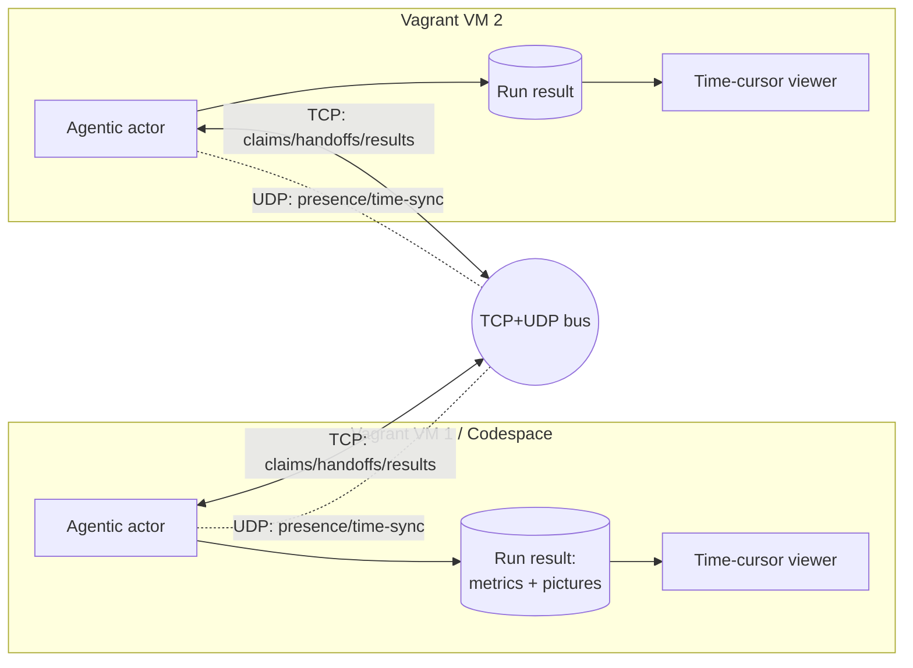

# labview-benchmark-actor — Architecture Description

> Standards baseline: `repo-standards-review` v0.2.19. Architecture description
> follows ISO/IEC/IEEE 42010 (stakeholders, concerns, viewpoints, views,
> architecture decisions). This is a planning description; no implementation is
> claimed.

## 1. Stakeholders and concerns (42010 §5.3)

| Stakeholder | Concern |
| --- | --- |
| Benchmark operator | Run benchmarks and review metric+picture evidence together over time |
| Extension maintainer | Clean extraction boundary from `vi-history-suite`; reproducible builds |
| Golden-VM / infra owner | Reproducible multi-VM provisioning; safe, offline coordination |
| Standards reviewer | Requirements→architecture→test traceability; stamped baseline |

## 2. Context

`labview-benchmark-actor` is extracted from `vi-history-suite` (LBA-REQ-001) and
installed on a Codespace or Vagrant golden VM (LBA-REQ-002). It runs benchmarks
via its agentic actor (LBA-REQ-003), presents them in a time-cursor viewer
(LBA-REQ-004/005), and coordinates across multiple VMs over a TCP/UDP bus
(LBA-REQ-006/007) instead of a GitHub Discussion.

## 3. Viewpoints and views (42010 §5.5–5.6)

### 3.1 Packaging / boundary view — addresses LBA-REQ-001, LBA-REQ-008
- The extension is a self-contained `.vsix`. Reused `vi-history-suite` logic is
  vendored or a pinned published dependency — never a relative path.
- A moved-module manifest records the extraction so the origin can be retired.

### 3.2 Deployment view — addresses LBA-REQ-002, LBA-REQ-006
- One artifact, two install targets (Codespace, Vagrant golden VM).
- A declarative topology spawns N VMs, each activating the extension with a
  unique participant identity; teardown is clean.

### 3.3 Actor / run-result view — addresses LBA-REQ-003
- The agentic actor drives a run and emits a **schema-versioned run result**:
  an ordered metric time-series and an ordered set of captured pictures, all on
  one run clock. This schema is the contract between actor and viewer.

### 3.4 Viewer view — addresses LBA-REQ-004, LBA-REQ-005
- A single **selected-time** value is the source of truth. The draggable
  vertical cursor writes it; the chart and the picture panel below read it.
- Pictures are indexed by run-relative timestamp for O(log n) nearest-at-or-
  before resolution; the panel shows the indexed frame or an explicit
  "no frame" state.

### 3.5 Coordination-transport view — addresses LBA-REQ-007
- **TCP** carries reliable, ordered coordination (claim / handoff / ack / done,
  results) preserving the GitHub-Discussion collab semantics
  (check-before-publish, one owner per hotspot).
- **UDP** carries presence/liveness and a time-sync beacon so multi-VM run
  clocks align for cross-VM benchmark comparison.
- Messages are schema-versioned with sender id, timestamp, and session id; a
  late joiner reconstructs session state from the TCP log.

## 4. Architecture decisions (42010 §5.7)

| AD | Decision | Rationale | Traces to |
| --- | --- | --- | --- |
| AD-1 | Extract as a standalone extension, not a fork | Clean boundary; independent release cadence | LBA-REQ-001 |
| AD-2 | One artifact, two install targets | Reproducible benchmarking baseline on Codespace and VM | LBA-REQ-002 |
| AD-3 | Single schema-versioned run-result contract | Decouples actor from viewer; enables reproducibility checks | LBA-REQ-003 |
| AD-4 | Single selected-time source of truth | Guarantees cursor↔picture synchronization | LBA-REQ-004/005 |
| AD-5 | TCP for order, UDP for presence/time-sync | Reliability where needed, low latency where tolerable | LBA-REQ-007 |
| AD-6 | Loopback / private-network bind by default | Offline, air-gapped, no public exposure | LBA-REQ-007 |
| AD-7 | Mirror the collab-bus semantics on the new transport | Preserve a proven coordination model across a transport change | LBA-REQ-007 |

## 5. Risks and open questions

- `[Open]` Exact bus wire format (length-prefixed JSON over TCP vs a framed
  protocol) — to be decided in a follow-up ADR.
- `[Open]` Time-sync accuracy target for cross-VM comparison (UDP beacon
  cadence and clock-skew bound).
- `[Open]` Picture capture source and cadence on each target (host vs container
  vs LabVIEW render) and its storage footprint.
- `[Risk]` Extraction scope creep — the moved-module manifest (AD-1) must be
  bounded before implementation to avoid dragging `vi-history-suite` internals.

## 6. Decision records

Detailed decisions are recorded as ADRs in [adr/](adr/README.md):

| ADR | Resolves | Owner |
| --- | --- | --- |
| [ADR-0001](adr/ADR-0001-run-result-schema.md) | Run-result schema (metrics + time-indexed pictures on one clock) | WIN |
| [ADR-0002](adr/ADR-0002-viewer-cursor-picture-binding.md) | Viewer single selected-time source of truth | WIN |
| ADR-0003 *(reserved)* | Coordination-bus wire format (the `[Open]` above) | LINUX |
| ADR-0004 *(reserved)* | Cross-VM time-sync accuracy (the `[Open]` above) | LINUX |

The picture-capture-source and extraction-scope `[Open]`/`[Risk]` items remain
open pending a capture-source ADR and the bounded moved-module manifest.
