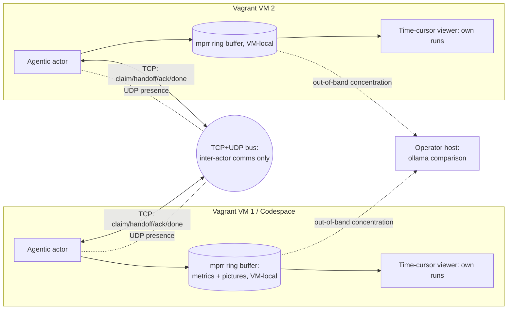

# labview-benchmark-actor — Architecture Description

> Standards baseline: `repo-standards-review` v0.2.19. Architecture description
> follows ISO/IEC/IEEE 42010 (stakeholders, concerns, viewpoints, views,
> architecture decisions). This is a planning description; no implementation is
> claimed.

## 1. Stakeholders and concerns (42010 §5.3)

| Stakeholder | Concern |
| --- | --- |
| Benchmark operator | Run benchmarks and review metric+picture evidence together over time |
| Extension maintainer | Clean extraction boundary from `vi-history-suite`; reproducible builds |
| Golden-VM / infra owner | Reproducible multi-VM provisioning; safe, offline coordination |
| Standards reviewer | Requirements→architecture→test traceability; stamped baseline |

## 2. Context

`labview-benchmark-actor` is extracted from `vi-history-suite` (LBA-REQ-001) and
installed on a Codespace or Vagrant golden VM (LBA-REQ-002). It runs benchmarks
via its agentic actor (LBA-REQ-003), presents them in a time-cursor viewer
(LBA-REQ-004/005), and coordinates across multiple VMs over a TCP/UDP bus
(LBA-REQ-006/007) instead of a GitHub Discussion. The bus carries **inter-actor
communication only**; run data (metrics + pictures) stays VM-local in **mprr**'s
ring buffer (LBA-REQ-009). Agents review only their **own** previous runs; the
operator concentrates runs to the host for an **ollama** comparison layer
(LBA-REQ-010).

## 3. Viewpoints and views (42010 §5.5–5.6)

### 3.1 Packaging / boundary view — addresses LBA-REQ-001, LBA-REQ-008
- The extension is a self-contained `.vsix`. Reused `vi-history-suite` logic is
  vendored or a pinned published dependency — never a relative path.
- A moved-module manifest records the extraction so the origin can be retired.

### 3.2 Deployment view — addresses LBA-REQ-002, LBA-REQ-006
- One artifact, two install targets (Codespace, Vagrant golden VM).
- A declarative topology spawns N VMs, each activating the extension with a
  unique participant identity; teardown is clean.

### 3.3 Actor / run-result view — addresses LBA-REQ-003
- The agentic actor drives a run and emits a **schema-versioned run result**:
  an ordered metric time-series and an ordered set of captured pictures, all on
  one run clock. This schema is the contract between actor and viewer.
- Captured pictures are stored **VM-locally** in mprr's ring buffer
  (long-packet), indexed via short-packet; the run result carries frame `ref`s
  into that local store, never image bytes (ADR-0005, LBA-REQ-009).

### 3.4 Viewer view — addresses LBA-REQ-004, LBA-REQ-005
- A single **selected-time** value is the source of truth. The draggable
  vertical cursor writes it; the chart and the picture panel below read it.
- Pictures are indexed by run-relative timestamp for O(log n) nearest-at-or-
  before resolution; the panel shows the indexed frame or an explicit
  "no frame" state.
- The viewer operates over the actor's **own** previous runs (local mprr
  store); there is no cross-VM comparison (LBA-REQ-010, ADR-0006).

### 3.5 Coordination-transport view — addresses LBA-REQ-007
- **TCP** carries reliable, ordered coordination (claim / handoff / ack / done /
  progress / note) preserving the GitHub-Discussion collab semantics
  (check-before-publish, one owner per hotspot).
- **UDP** carries presence/liveness (and a coordination time reference); it is
  **not** used for run comparison, since runs are never compared across VMs
  (ADR-0006).
- Messages are schema-versioned with sender id, timestamp, and session id; a
  late joiner reconstructs session state from the TCP log.
- The bus carries **inter-actor communication only** (claim/handoff/ack/done/
  note); it never carries run data, run/frame metadata, or images — the entire
  mprr ring buffer stays VM-local (ADR-0005, LBA-REQ-009).

## 4. Architecture decisions (42010 §5.7)

| AD | Decision | Rationale | Traces to |
| --- | --- | --- | --- |
| AD-1 | Extract as a standalone extension, not a fork | Clean boundary; independent release cadence | LBA-REQ-001 |
| AD-2 | One artifact, two install targets | Reproducible benchmarking baseline on Codespace and VM | LBA-REQ-002 |
| AD-3 | Single schema-versioned run-result contract | Decouples actor from viewer; enables reproducibility checks | LBA-REQ-003 |
| AD-4 | Single selected-time source of truth | Guarantees cursor↔picture synchronization | LBA-REQ-004/005 |
| AD-5 | TCP for order, UDP for presence/time-sync | Reliability where needed, low latency where tolerable | LBA-REQ-007 |
| AD-6 | Loopback / private-network bind by default | Offline, air-gapped, no public exposure | LBA-REQ-007 |
| AD-7 | Mirror the collab-bus semantics on the new transport | Preserve a proven coordination model across a transport change | LBA-REQ-007 |
| AD-8 | Store all run data in the VM-local mprr ring buffer; bus carries inter-actor comms only | Reuse mprr's governed bounded-RAM ring buffer; keep the bus data-agnostic; cleanroom isolation | LBA-REQ-009 |
| AD-9 | No cross-VM comparison; concentrate runs to the host for an ollama layer | Preserve cleanroom isolation; improve comparison on one concentrated corpus | LBA-REQ-010 |

## 5. Risks and open questions

- `[Resolved ADR-0003]` Bus wire format — length-prefixed JSON over TCP.
- `[Resolved ADR-0004]` Cross-VM time-sync — UDP beacon cadence + clock-skew
  bound.
- `[Open]` Picture capture *source* and cadence per target (host vs container
  vs LabVIEW render). **Storage is resolved (ADR-0005): the VM-local mprr ring
  buffer**; the remaining open is the capture source/cadence and the
  benchmark-frame → mprr-long-packet mapping.
- `[Risk]` Extraction scope creep — the moved-module manifest (AD-1) must be
  bounded before implementation to avoid dragging `vi-history-suite` internals.

## 6. Decision records

Detailed decisions are recorded as ADRs in [adr/](adr/README.md):

| ADR | Resolves | Owner |
| --- | --- | --- |
| [ADR-0001](adr/ADR-0001-run-result-schema.md) | Run-result schema (metrics + time-indexed pictures on one clock) | WIN |
| [ADR-0002](adr/ADR-0002-viewer-cursor-picture-binding.md) | Viewer single selected-time source of truth | WIN |
| [ADR-0005](adr/ADR-0005-image-storage-mprr-ringbuffer-cleanroom.md) | Image/frame storage via mprr ring buffer in the VM cleanroom (no image transport) | WIN |
| [ADR-0006](adr/ADR-0006-run-concentration-ollama-comparison.md) | Run concentration to the host + ollama comparison (no cross-VM) | WIN |
| [ADR-0003](adr/ADR-0003-coordination-bus-wire-format.md) | Coordination-bus wire format (length-prefixed JSON over TCP) | LINUX |
| [ADR-0004](adr/ADR-0004-cross-vm-time-sync.md) | Cross-VM time-sync (UDP beacon cadence + skew bound) | LINUX |

Remaining open items: the picture-capture *source*/cadence (storage itself is
resolved by ADR-0005) and the extraction-scope `[Risk]` (the bounded
moved-module manifest).
