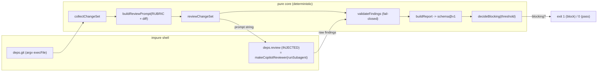

# Local pre-push code-review gate — DESIGN (prototype)

> Sandbox prototype under `prototype/local-review/`. Nothing here is wired into
> shared repo state (no changes to `.githooks/`, root `package.json`, `src/`,
> `tests/`, `docs/`). It is a self-contained, dependency-free Node ESM package.

## 1. Goal

Emulate the **GitHub Copilot PR reviewer BEFORE a push** so the bot has fewer/no
comments to make. The review "engine" is an **injectable seam** (`deps.review`)
so the whole pipeline is deterministic and unit-testable **without a live model**
(tests inject a fake reviewer). In production the main agent injects a
`runSubagent`-backed reviewer.

The gate is **enforcing**: any finding at or above a configurable severity
threshold makes the CLI exit non-zero, which aborts the push from a `pre-push`
hook.

## 2. Architecture

Two layers with a hard boundary:

| Layer | Files | Purity |
|---|---|---|
| **Pure core** (rubric, prompt, validation, threshold, report) | `reviewDiff.mjs` (exports) | No I/O, deterministic, fail-closed |
| **Impure shell** (git, fs, model call, argv) | `reviewDiff.mjs` (CLI `main`), `reviewers/copilotSubagent.mjs` | Side effects only through injected deps |

### Module map

- `reviewDiff.mjs`
  - **Data:** `RUBRIC`, `REPORT_SCHEMA`, `SCHEMA_VERSION`, `SEVERITY_ORDER`.
  - **Pure fns:** `parseNameStatus`, `buildReviewPrompt`, `validateFinding`,
    `validateFindings`, `sortFindings`, `decideBlocking`, `countBySeverity`,
    `buildReport`, `formatHumanSummary`.
  - **Seam-using:** `reviewChangeSet(changeSet, deps)`,
    `collectChangeSet(opts, deps)`.
  - **Shell:** `defaultGit` (argv `execFile`, no shell), `refusingReviewer`
    (fail-closed default that never fabricates), `main()` CLI.
- `reviewers/copilotSubagent.mjs` — the `runSubagent` adapter: `extractJsonArray`,
  `mapSubagentOutputToFindings`, `makeCopilotReviewer(runSubagent)`.
- `reviewDiff.test.mjs`, `reviewers/copilotSubagent.test.mjs` — 47 tests, all
  with injected fakes (no model, no real git).
- `examples/*.json` — canned findings for CLI demos.

### Data flow



## 3. The RUBRIC (recurring Copilot findings, encoded as data)

Each rule is `{ id, letter, defaultSeverity, title, guidance, antipattern }` and
is embedded verbatim into the review prompt.

| # | id | default | Enforces |
|---|---|---|---|
| a | `fail-closed-input-validation` | **blocker** | Pure models throw a typed error on malformed input; never coerce/fabricate. |
| b | `comment-implementation-agreement` | warning | A doc comment must not claim behavior the code doesn't implement (e.g. "UTC round-trip" when only `Date.parse` is used). |
| c | `iso8601-strict-parsing` | warning | Validate ISO-8601 shape AND reject impossible calendar dates; `Date.parse` is too permissive. |
| d | `side-effect-contract-tests` | warning | Tests assert side-effect contracts (e.g. before/after "no repo pollution"). |
| e | `sequential-external-tool-tests` | warning | Real external-tool tests run sequentially, not via `Promise.all`. |
| f | `typed-result-unions-at-io` | warning | I/O boundaries return `{ ok, ... }` unions instead of throwing on expected failures. |
| g | `determinism-by-construction` | warning | Stable ordering/ids; no unseeded `Date.now()`/`Math.random()` in pure output. |
| h | `additive-schema-evolution` | warning | Schema changes are additive under `@v1`; breaking changes require `@v2` + migration. |

The core itself dogfoods the rubric: `sortFindings` is a total order (g),
`buildReport` emits `schema@v1` + `schemaVersion:1` and only ever **adds** fields
(h), every pure fn fail-closes on bad input (a), and `defaultGit` uses an argv
array (no shell string) so there is no injection surface.

### 3.1 The LEARNED_RUBRIC (iterative strictness)

The base a–h rubric is curated; the reviewer also gets **monotonically stricter,
review-over-review**, from a second data array: `LEARNED_RUBRIC`.

Whenever the GitHub Copilot bot surfaces a finding on a PR that this local
reviewer **missed**, we distil the lesson into a rule and append it to
`LEARNED_RUBRIC`. Each learned rule adds a `source` field naming the PR and the
concrete symbol, so every strictness increment is auditable. Learned letters use
an `L` prefix (`L1`, `L2`, …) so they never collide with the a–h base, and the
prompt prints a `LEARNED FROM:` line for each so the model sees the provenance.

`buildReviewPrompt` embeds `ACTIVE_RUBRIC = [...RUBRIC, ...LEARNED_RUBRIC]` by
default, so the gate enforces the accumulated lessons automatically. The loop:

1. Push a PR → Copilot reviews it.
2. For each Copilot finding the local reviewer did **not** already catch, add a
   `LEARNED_RUBRIC` entry (id, guidance, a concrete anti-pattern, and `source`).
3. Next push runs against the enlarged rubric → that class of issue never leaks
   to the bot twice.

| # | id | default | Learned from |
|---|---|---|---|
| L1 | `return-the-normalized-value` | warning | PR #2352 — a validator checked `trimmed.length` but returned the raw `value`. |
| L2 | `doc-adjective-must-be-enforced` | warning | PR #2352 — `safeSlice` was documented "single-line" but only trimmed. |
| L3 | `disambiguate-multi-match-alias` | warning | PR #2356 — a loose `working set` substring match became order-dependent (total vs private) once the full profile added a 2nd matching column. |
| L4 | `presence-check-is-not-a-type-check` | warning | PR #2356 — a builder guarded an optional input with `!== undefined` then called `.trim()` on it, throwing a raw `TypeError` on null/non-string untyped input instead of failing closed. |
| L5 | `no-side-effects-in-array-predicate` | warning | PR #2356 — a dedupe mutated a `Set` inside an `Array.filter` comma-operator predicate; refactored to an explicit first-seen-order loop. |
| L6 | `content-address-normalize-both-sides` | warning | PR #2361 — a content-addressed store hashed the raw path on `put()` but the POSIX-normalized path on `get()`, so a backslash-separator write was unretrievable. |
| L7 | `structured-not-prose-tool-results` | warning | PR #2361 — an MCP tool returned a free-text "No generated code found" sentence on not-found instead of a structured `{status:"not-found"}` object flagged as an error. |
| L8 | `construct-shared-resource-once` | warning | PR #2361 — the scan store was re-created inside the per-call handler instead of once where the MCP server deps are wired. |
| L9 | `read-guard-mirrors-builder-validation` | warning | PR #2361 — a fail-closed read guard accepted whitespace-only fields and a non-ISO `generatedAt` the constructive builder rejects; tightened via shared `isNonBlankString`/`isIsoTimestamp`. |
| L10 | `side-effect-only-on-real-work` | warning | PR #2362 — a best-effort preview-time scan fired on cache-hit renders (`result.cached === true`) that ran no runtime; gated on real work. |
| L11 | `best-effort-sink-must-report-outcome` | warning | PR #2362 — a best-effort store `put` swallowed fs errors and returned void, so the caller falsely reported `persisted`; changed to return a boolean so the caller reports `store-write-failed`. |
| L12 | `precise-parent-escape-check` | warning | PR #2362 — a path-escape check used `rel.startsWith("..")`, over-rejecting a valid in-root file named `..diagnostic.vi`; narrowed to `rel === ".."` or a `".." + sep` prefix. |
| L13 | `guard-side-effect-callback` | warning | PR #2362 — a fire-and-forget `onPreviewScanReady` callback on the preview resolve path was unguarded; a throw would fail the preview. Wrapped in try/catch. |
| L14 | `doc-must-track-outcome-cases` | warning | PR #2362 — a typed-outcome doc said `errored` only covers a throw after a non-throwing `store-write-failed` case was added under `errored`. |
| L15 | `purity-claim-must-track-imports` | warning | PR #2362 — a module header still claimed "no I/O" after a node-fs factory was moved into it; scoped the purity claim to the pure core. |

### 3.2 The pre-commit reviewer's shift-left ledger

The pre-commit reviewer (`precommitReview.mjs`) keeps its fast, disjoint
deterministic hygiene checks, but ALSO gets iteratively stricter from **two
downstream feeds**, so a class caught at a later gate is promoted to commit time
and flagged one gate earlier next round:

- **Feed 1 — the Copilot PR bot** → `LEARNED_HYGIENE_RUBRIC` (native array).
  Hygiene/commit-time-checkable classes the bot raised that this gate missed.
  `promotedFrom: 'copilot-pr'`.
- **Feed 2 — the pre-push reviewer** → `PROMOTED_FROM_PREPUSH`, an automatic
  mirror of `reviewDiff.mjs`'s `LEARNED_RUBRIC` (imported, mapped to hygiene
  judgment rules). Add a rule once in the pre-push `LEARNED_RUBRIC` and it shows
  up here for free. `promotedFrom: 'pre-push'`.

Both feeds are **model-judged** (`deterministic: false`) and **warning-only** —
an early best-effort semantic check never hard-blocks a commit; only the
deterministic hygiene blockers do. `buildHygieneModelPrompt` embeds
`ACTIVE_HYGIENE_RUBRIC = base ∪ pre-push feed ∪ Copilot-PR feed` (deduped by id)
and prints a `(promoted from <feed>: <source>)` provenance tag per learned rule.

The loop: a finding escapes commit → is caught by the pre-push reviewer or the
Copilot PR bot → distil it into the matching feed → next commit the pre-commit
model asks for that class too. Detection ratchets left, review-over-review.


## 4. The reviewer-injection seam (the key deliverable)

### 4.1 Seam signature

```ts
type Severity = 'blocker' | 'warning' | 'nit';

interface Finding {
  file: string;
  line: number | null;
  severity: Severity;
  message: string;
  ruleId?: string;         // additive/optional (schema rule h)
}

// The injectable seam. `deps.review` is the ONLY place a model is consulted.
type ReviewFn = (prompt: string) => Promise<unknown[]>;   // raw, unvalidated
interface Deps { review?: ReviewFn; git?: (args: string[]) => Promise<string>; }

async function reviewChangeSet(
  changeSet: { diff: string; files: { status: string; path: string }[] },
  deps: Deps,
): Promise<Finding[]>;      // validates deps.review output fail-closed
```

`reviewChangeSet` builds the prompt, calls `deps.review(prompt)`, then runs the
raw result through `validateFindings` — so **malformed model output is rejected,
never trusted** (rubric a). Tests inject a fake `review`; production injects the
`runSubagent` adapter below.

### 4.2 How the main agent wires `runSubagent` → `Finding[]`

`runSubagent` is a capability of the agent session, not of a Node/git process, so
it is **injected as a parameter**. The adapter (`reviewers/copilotSubagent.mjs`,
already implemented + tested) is:

```ts
type RunSubagent = (input: { description: string; prompt: string }) => Promise<unknown>;

// Returns a ReviewFn suitable for deps.review.
function makeCopilotReviewer(runSubagent: RunSubagent, opts?: { description?: string }): ReviewFn;

// Pure mapping helpers (unit-tested without a model):
function extractJsonArray(text: string): string;            // ```json fence -> else first '[' .. last ']'
function mapSubagentOutputToFindings(result: unknown): unknown[]; // string | {text} | {output} -> raw[]
```

The main agent uses it like this (conceptual — `runSubagent` is the agent's tool):

```js
import {
  collectChangeSet, reviewChangeSet, buildReport, formatHumanSummary, defaultGit,
} from './reviewDiff.mjs';
import { makeCopilotReviewer } from './reviewers/copilotSubagent.mjs';

// `runSubagent` is provided by the agent runtime.
const deps = {
  git: defaultGit,
  review: makeCopilotReviewer(runSubagent, {
    description: 'Local pre-push code review (Copilot-style)',
  }),
};

const changeSet = await collectChangeSet({ base: 'develop' }, deps);
const findings  = await reviewChangeSet(changeSet, deps); // -> validated Finding[]
const report    = buildReport({ findings, threshold: 'warning' });

process.stdout.write(formatHumanSummary(report) + '\n');
process.exit(report.blocking ? 1 : 0);
```

Mapping detail (`mapSubagentOutputToFindings`): accept a raw string or
`{ text }`/`{ output }`; pull the JSON array out of the model's free-form text
(preferring a fenced ` ```json ` block, else the outermost `[ … ]`, which also
tolerates a `{ "findings": [ … ] }` wrapper); `JSON.parse`; hand the raw array to
the core, which fail-closes on shape. Any non-JSON / no-array output throws
`ReviewInputError` — the push is blocked rather than passed on garbage.

## 5. Report schema

```jsonc
{
  "schema": "vi-history-suite/local-review@v1",
  "schemaVersion": 1,
  "threshold": "warning",
  "findings": [ { "file": "...", "line": 12, "severity": "warning", "message": "...", "ruleId": "..." } ],
  "blocking": true,
  "summary": { "total": 5, "blockers": 1, "warnings": 3, "nits": 1, "blockingCount": 4, "threshold": "warning" }
}
```

Evolution is additive under `@v1`; a field removal/rename/type-change would ship
as `@v2` with a migration note (rubric h).

## 6. Enforcing `.githooks/pre-push` wiring (SNIPPET — text only)

> Do **not** paste over an existing hook. Integrate this block; the real hook is
> not modified by this prototype. The gate needs a wired reviewer (§4.2); in a
> plain hook shell `runSubagent` is unavailable, so pick one of two modes.

### Mode A — reviewer script the hook can execute

```sh
#!/usr/bin/env sh
# --- local-review gate (append/integrate; keep your existing hook body) --------
REVIEW_DIR="prototype/local-review"
REVIEWER="$REVIEW_DIR/reviewers/modelCli.mjs"          # exports `review` (shells to your model CLI)
THRESHOLD="${LOCAL_REVIEW_THRESHOLD:-warning}"

# Audited emergency bypass.
if [ "${LOCAL_REVIEW_SKIP:-0}" = "1" ]; then
  echo "local-review: SKIPPED (LOCAL_REVIEW_SKIP=1)" >&2
  exit 0
fi

# Base = the upstream branch we are pushing onto, else develop.
BASE="$(git rev-parse --abbrev-ref --symbolic-full-name '@{upstream}' 2>/dev/null || echo develop)"

echo "local-review: reviewing ${BASE}...HEAD (threshold=${THRESHOLD})" >&2
if node "$REVIEW_DIR/reviewDiff.mjs" \
      --base "$BASE" \
      --threshold "$THRESHOLD" \
      --reviewer "$REVIEWER" \
      --out "$REVIEW_DIR/.last-report.json"; then
  exit 0
else
  echo "local-review: BLOCKED push — resolve findings above. Report: $REVIEW_DIR/.last-report.json" >&2
  exit 1
fi
```

### Mode B — agent-driven, hook enforces freshness

The agent runs the review in-session (it has `runSubagent`) and writes
`.last-report.json`; the hook refuses to push unless a fresh, non-blocking report
exists for the current range:

```sh
#!/usr/bin/env sh
REVIEW_DIR="prototype/local-review"
REPORT="$REVIEW_DIR/.last-report.json"
HEAD_SHA="$(git rev-parse HEAD)"

# Require: report exists, is for this HEAD, and is non-blocking.
if [ ! -f "$REPORT" ]; then
  echo "local-review: no report — run the in-editor review before pushing." >&2
  exit 1
fi
node -e '
  const fs=require("fs"); const r=JSON.parse(fs.readFileSync(process.argv[1],"utf8"));
  if (r.schema!=="vi-history-suite/local-review@v1") { console.error("bad schema"); process.exit(1); }
  if (r.reviewedHead!==process.argv[2]) { console.error("stale report (HEAD changed)"); process.exit(1); }
  if (r.blocking) { console.error("blocking findings present"); process.exit(1); }
' "$REPORT" "$HEAD_SHA" || { echo "local-review: BLOCKED push." >&2; exit 1; }
```

*(Mode B needs the report to carry `reviewedHead`; that is an additive `@v1`
field per rubric h and can be added to `buildReport` when this graduates.)*

To activate a repo-managed hooks dir (documentation only, not run here):
`git config core.hooksPath .githooks`.

## 7. Limitations

- **No live model in the prototype.** The default reviewer (`refusingReviewer`)
  fail-closes with guidance; the CLI runs end-to-end only with `--findings`
  (canned), `--reviewer <module>`, or `--prompt-out` + external tool. This is
  deliberate — the task forbids invoking a real model here.
- **Diff-only context.** The reviewer sees the unified diff + changed-file list,
  not the whole repo, so cross-file/architectural issues the bot might catch with
  full context can be missed. `--unified=3` context is tunable.
- **`extractJsonArray` heuristic.** "First `[` .. last `]`" is robust for a single
  top-level array (and object-wrapped arrays) but could mis-slice pathological
  output with multiple sibling arrays; such cases fail closed at `JSON.parse`.
- **Non-determinism lives in the model.** The core is deterministic; a live
  reviewer is not. Lowering variance is a prompt/threshold concern, not a core one.
- **Hook shell vs `runSubagent`.** A git hook cannot call the agent tool directly,
  hence Modes A/B. Mode A needs a model CLI; Mode B needs the agent to pre-run.
- **`develop` merge queue.** `@{upstream}` base detection assumes a tracking
  branch; falls back to `develop`.

## 8. How this reduces bot review volume

- **Same rubric, earlier.** The prompt encodes the exact recurring findings the
  Copilot bot raises here (a–h). Fixing them pre-push means the bot arrives to a
  change set already cleared of its common comments.
- **Blocker class is eliminated before push.** `fail-closed-input-validation`
  (the one default **blocker**) plus comment/impl-agreement and permissive-date
  parsing are the highest-frequency bot comments; gating on them at `warning`
  threshold stops those pushes until fixed.
- **Deterministic gate, human-readable output.** Authors see
  `formatHumanSummary` locally and fix in-loop, rather than round-tripping through
  a PR, a bot comment, a force-push, and a re-review.
- **Schema-tagged report** enables trend tracking (which rubric ids fire most) so
  the rubric — and thus the pre-empted bot comments — can be tuned over time.
- **Net effect:** the bot's comments shift from "found N issues" toward "no
  comments", because the local gate has already enforced the same contract.

## 9. Run it

```sh
cd prototype/local-review

# Tests (pure core + adapter, injected fakes, no model):
node --test                       # 47 passing

# CLI demos (canned findings, no model):
node reviewDiff.mjs --findings examples/sample-findings.json          # BLOCK, exit 1
node reviewDiff.mjs --findings examples/sample-findings.json --json   # schema@v1 JSON
node reviewDiff.mjs --findings examples/clean-findings.json           # PASS, exit 0
node reviewDiff.mjs --threshold blocker --findings examples/sample-findings.json

# Real git change-set collection, hand prompt to an external reviewer:
node reviewDiff.mjs --base develop --prompt-out /tmp/review-prompt.txt

# Default reviewer refuses to fabricate (exit 2):
node reviewDiff.mjs
```
